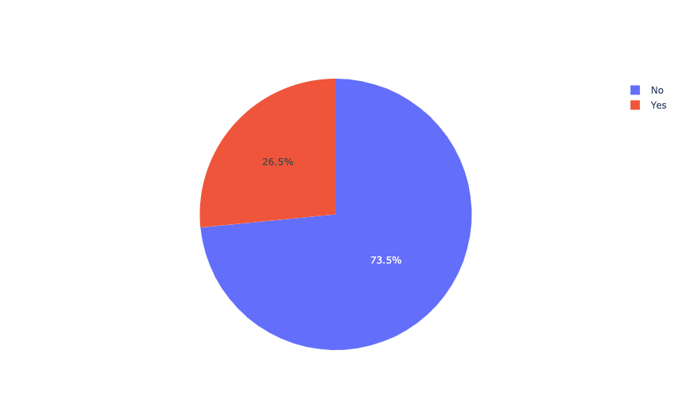
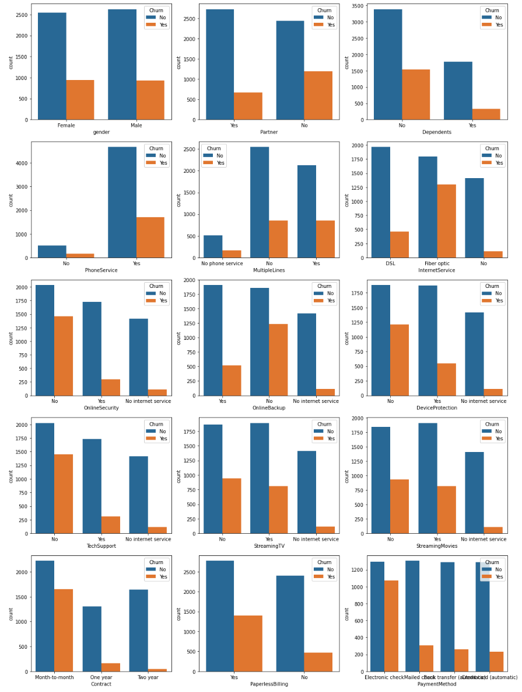
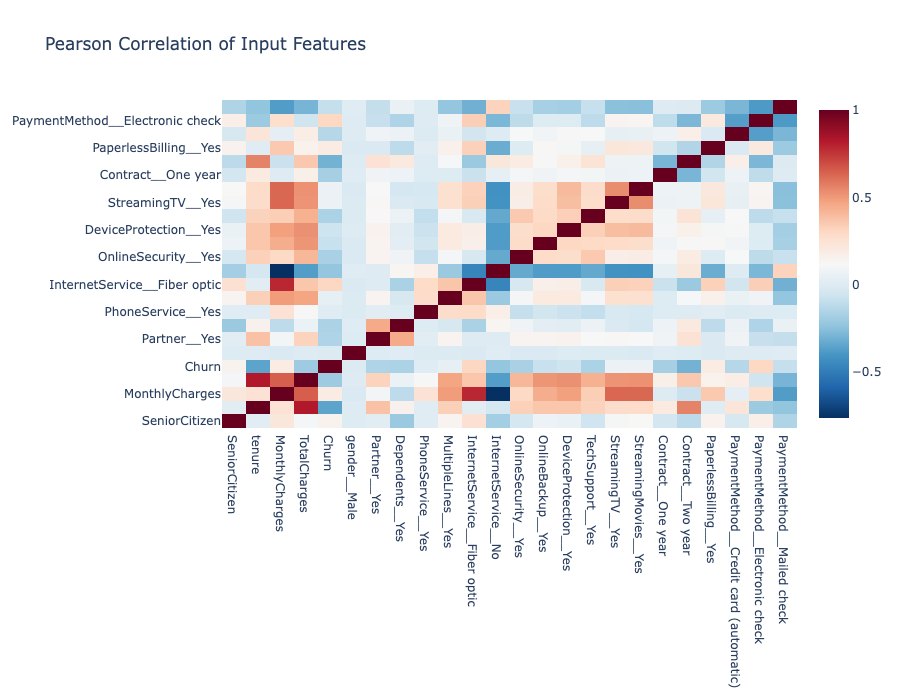
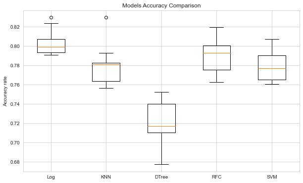
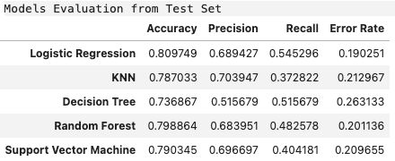

# Telco-customer-churn
- [Goal](#Project-Goal)
- [Installation](#Installation)
- [File Descriptions](#File-Descriptions)
- [Instructions](#How-To-Run-This-Project)
- [EDA](#EDA)
- [Regression Models](#Models)
- [Licensing, Authors, Acknowledgements](#License)

## Project Goal 
This project aims to select a classification model to predict the churn rate of telecom customers.

## Installation 
The following packages and versions are used in this notebook. Any newer versions should work. 
| Package  | Version |
| ------------- | ------------- |
| Python  | 3.8.5  |
| Pandas  | 1.1.3  |
| Numpy   | 1.19.2 |
| Matplotlib | 3.3.2|

## File Description 
There are 3 files in this repository.  
The dataset in `.csv`  
A Jupyter notebook `.ipynb` includes the process of reading in, preprocessing, and modeling the dataset.  
A README.md file as a brief look at this repository.

## Exploratory Data Analysis 

 
Figure 1. The distribution of churn (Yes) and loyal (No) customers. 

By counting the number of customers churn and no-churn, I observed an imbalanced dataset in which the number of "no" labels is nearly 3x more than the "yes" labels. 

 
Figure 2. Categorical features with respect to churn labels

I'm looking into each categorical feature to understand their influence on the customers' churn decisions. The general insights drawn from the charts are:
- Churn rate is low for the No-internet-service feature
- Churn rate is significantly high for Month-to-month contracts and Electronic-check payment method

 
Figure 3. Pearson Correlation of Input Features and Churn 

Features that are highly correlated to Churn rate are:
- Payment Method - Electronic Check
- Internet Service - Fiber optic
- Monthly Charges
- Paperless Billing
- Senior Citizen

Features that contribute to high monthly charges/total charges:
- Streaming TV and movies
- Fiber optic
- Online Backup
- Device Protection

## Regression Models 
**Regression models** 
I compared the performance of 5 models:
- Logistic regression
- KNN
- Decision tree
- Random forest
- Support Vector Machine

**Classification Metrics to focus on** 
First, it's generally preferable to have a model with high **accuracy** predicting customer churn. 

73.5% of customers currently are loyal to the service. Therefore, I want to retain these customers by correctly predicting customers likely to churn. **Precision** is the 2nd important metric. 

Assuming that it is inexpensive to lose a customer, I want to give out promotions to those predicted to churn. I will try to minimize the wrongly predicted no-churn (FN), a high **recall** value is also a good metric. 

 
Figure 4. Models accuracy comparison on the train set.  

 
Figure 5. Models performance comparison on the test set.

Classification metrics results from both the train and test set show that the **Logistic regression** model achieved high scores across all metrics. 

## Instructions 
* Execute the codes in this notebook and follow along with the insights to understand the decisions made throughout the process.
* [This project](https://www.kaggle.com/code/azeotrope/telco-customers-retention-classification/notebook) is also avaialbe on my [Kaggle profile](https://www.kaggle.com/azeotrope)

## Licensing, Authors, Acknowledgements 
* The data set, licensing, and other descriptive information are available on [Kaggle](https://www.kaggle.com/datasets/blastchar/telco-customer-churn)
